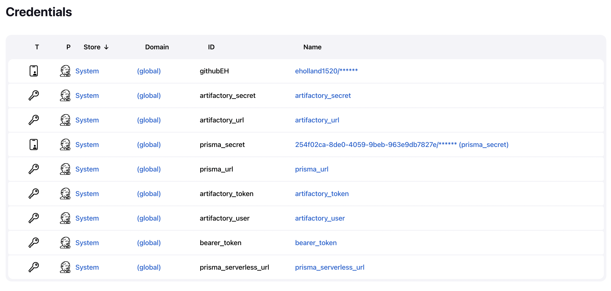

# Jenkins Pipeline with TwistCLI Image Analysis Sandbox
The following document is provided as high level example of how to integrate Prisma Cloud TwistCLI into a Jenkins pipeline using a groovy script.

#### Steps 
1. Create a Prisma Cloud Service Account with a DevOps role in Prisma Cloud Compute.
2. Install the Prisma Compute plugin in your Azure DevOps Organization.
3. Build an Azure DevOps pipeline to scan a docker image for vulnerabilities with TwistCli.
4. View the vulnerability report produced by the TwistCli image scan.

## 1. Create Prisma Cloud Service Account
Settings --> Access Control --> User --> Click "Add" button and select "Service Account". Provide a name for the service account and select "DevOps-role" to enable scanning permissions for the service account.
<p align="center">

</p>

After creating the service account you will be prompted to create an access key for the service account. Provide a name for the service account and click "Next".
<p align="center">

</p>

After the access key has been created you are give the access key ID and the access key secret token. These values are the user and password that you will need when authenticating to the consolfe from your Azure DevOps pipeline. Be sure to save these values in a secure place (Azure Keyvault).
<p align="center">

</p>

Now that you have a service account user and a user/password for authentication you can move on to Azure DevOps.
<p align="center">

</p>

## 2. Create prisma cloud credentials in Jenkins credential manager
This extension enables Prisma Cloud container image / serverless zip scan functionality from Palo Alto Networks Inc. in Azure DevOps.

Features:
* Scan container images
* Scan serverless zip files in pipelines
* Define severity based failure criteria for pipelines
* Setup service connection to Prisma Cloud Compute Console

The Prisma Compute plugin is available from the Azure Marketplace:
https://marketplace.visualstudio.com/items?itemName=PrismaCloud.build-release-task

A service connection is created during the isntallation of the the plugin into your Azure DevOps organization. You will have to provide the console url, access key id and the secret access key during the installation process.

Create Prisma Cloud credentials in Jenkins for pipeline access to the Prsima Cloud Compute console
<p align="center">

</p>


## 3. Jenkins Pipeline with TwistCli Image Analysis Sandbox
Now that you have a service account in Prisma Cloud with the "Build and Deploy Security" role and the Prisma Compute plugin installed into your organization your are ready to start utilizing TwistCLI from your Jenkins pipelines. The example pipeline consists of the following tasks/steps:

1. Build a docker image
2. Run the docker image using TwistCLI
3. If the image passes the previous scan, push the image to Artifactory

The next 3 steps in the pipeline demonstrate the same as above utilizing twistcli from the command line.
1. Retrieve access token and console url from Jenkins credentials
2. Use access key to download and install the TwistCLI binary from the Prisma Cloud console
3. Run image analysis using TwistCLI (Pass/Fail)

#### TwistCLI Image Analysis Sandbox Command Line
The Jenkins pipeline executes the following twistcli commands during build pipeline execution.

```
#vDownload the twistcli binary from the console (Task: Install TwistCLI)
curl -k -O -u [access key id]:[secret access key] [console url]/api/v1/util/twistcli;
chmod a+x twistcli;

# Run the image analysis sandbox on the prisma-rabbitmq docker image (Task: Scan RabbitMQ Image)
twistcli sandbox --analysis-duration 30s --address ${TWISTLOCK_URL} --u ${SECR_USR} -p ${SECR_PSW} bitnami/rabbitmq
```

#### Groovy Pipeline
```
 
 pipeline {
     environment {
      SECR = credentials("prisma_secret")
      TWISTLOCK_URL = credentials("prisma_url")
      ARTIFACTORY_SECR = credentials("artifactory_secret")
      ARTIFACTORY_URL = credentials("artifactory_url")
    }
   
    agent any 
    stages {
        stage('Install TwistCli') { 
            steps {
                 sh '''#!/bin/bash
                  echo "hello world"
                  echo "Install TwistCLI"
                  ls
                  echo $SECR_USER
                  echo $SECR_CONSOLEURL
                  echo $SECR_PASSWORD
                  curl -k -O -u $SECR_USR:$SECR_PSW $TWISTLOCK_URL/api/v1/util/twistcli
                  pwd
                  ls
                  env
                  chmod a+x twistcli;
                '''
            }
        }
     stage('Pull Public Docker Image') { 
            steps {
                  sh '''#!/bin/bash
                  docker pull bitnami/rabbitmq
                '''
            }
        }
        stage('Runtime - Image Analysis Sandbox') { 
            steps {
                  sh '''#!/bin/bash
                  echo "Start Image Scan"
                  sudo ./twistcli sandbox --analysis-duration 30s --address ${TWISTLOCK_URL} --u ${SECR_USR} -p ${SECR_PSW} bitnami/rabbitmq
                '''
            }
        }
    }
 }

```
## 4. View TwistCLI Image Analysis Sandbox Report
**Note**: The following screenshot shows the output of an image scan from an Azure DevOps pipeline.
<p align="center">

</p>

Detailed results from the image scan can also be viewed from the Prisma Cloud console by navigating to Compute --> Monitor --> Vulnerabilites --> Images --> CI

The Prisma Cloud Console lets you drill down into the details of the image scan. The example belows shows the 'Layers' tab in 'Image Details'.
<p align="center">

</p>
