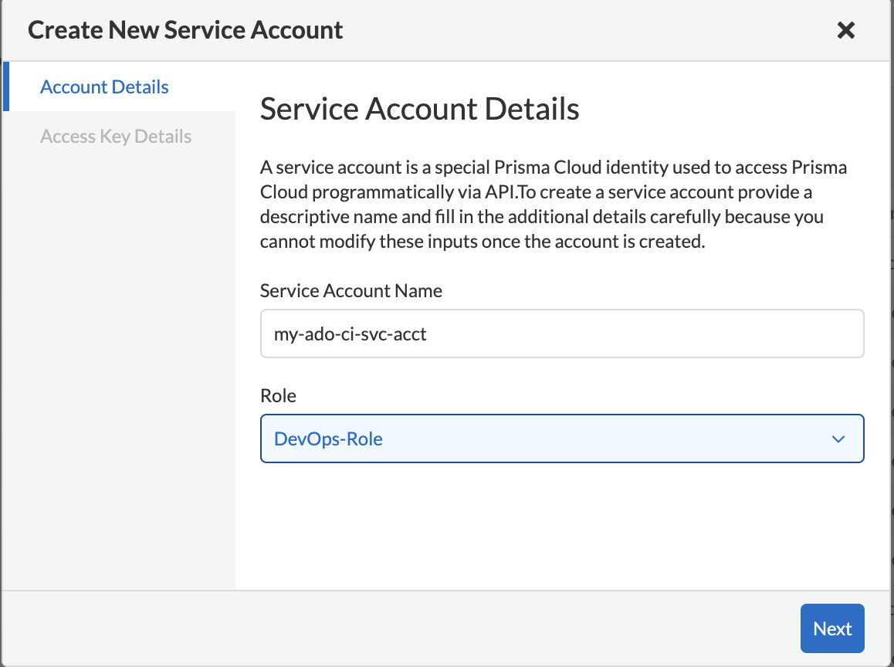
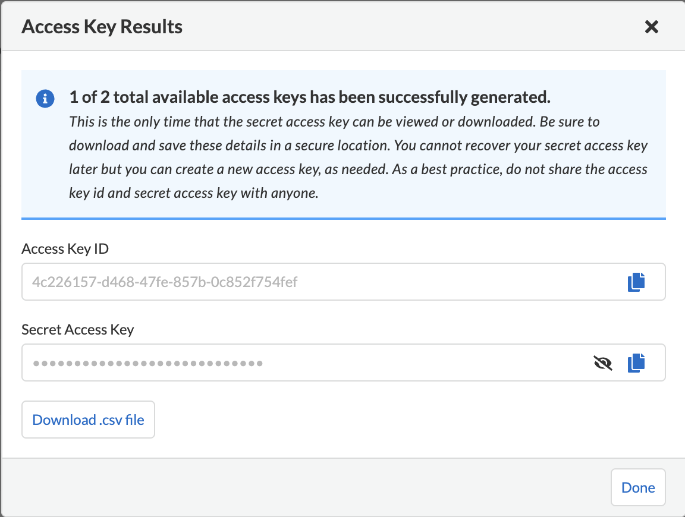
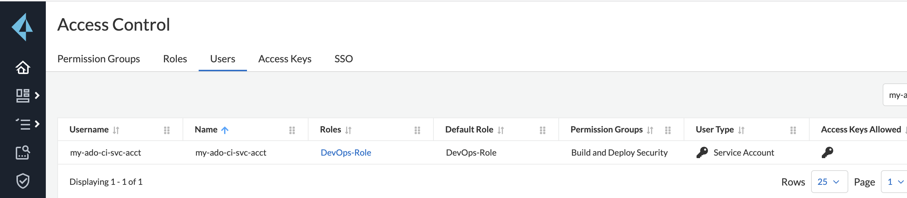
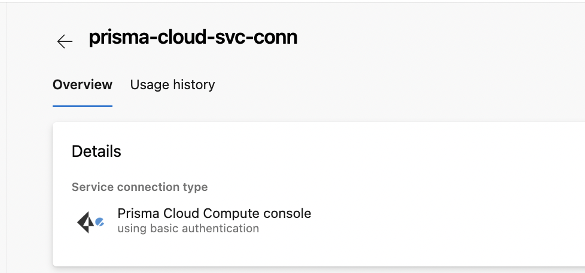
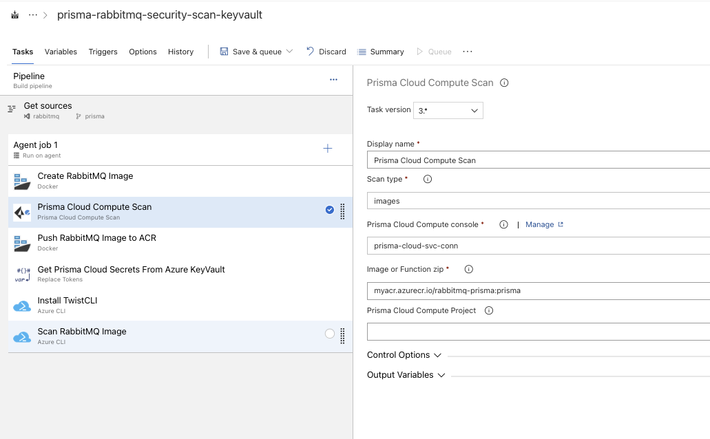
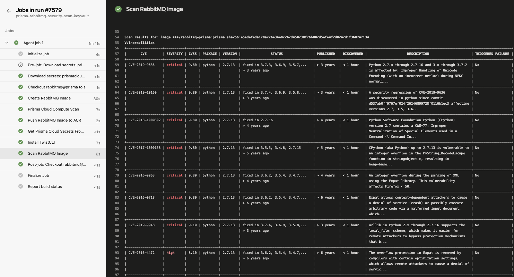
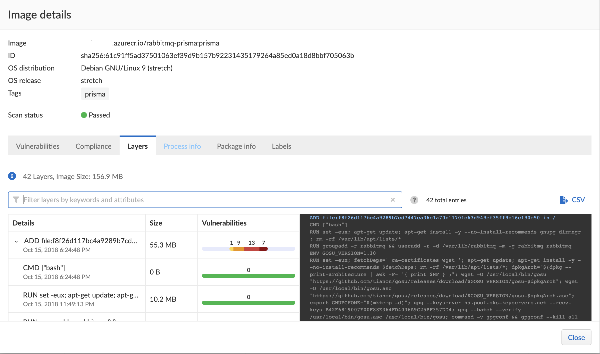

# Azure DevOps Pipeline with TwistCLI Image Scanning

The following document is provided as high level example of how to integrate Prisma Cloud TwistCLI into and Azure DevOps pipeline using either the classic graphical editor in ADO or via YAML pipeline template.

#### Steps 
1. Create a Prisma Cloud Service Account with a DevOps role in Prisma Cloud Compute.
2. Install the Prisma Compute plugin in your Azure DevOps Organization.
3. Build an Azure DevOps pipeline to scan a docker image for vulnerabilities with TwistCli.
4. View the vulnerability report produced by the TwistCli image scan.

## 1. Create Prisma Cloud Service Account
Settings --> Access Control --> User --> Click "Add" button and select "Service Account". Provide a name for the service account and select "DevOps-role" to enable scanning permissions for the service account.
<p align="center">

</p>

After creating the service account you will be prompted to create an access key for the service account. Provide a name for the service account and click "Next".
<p align="center">

</p>

After the access key has been created you are give the access key ID and the access key secret token. These values are the user and password that you will need when authenticating to the consolfe from your Azure DevOps pipeline. Be sure to save these values in a secure place (Azure Keyvault).
<p align="center">

</p>

Now that you have a service account user and a user/password for authentication you can move on to Azure DevOps.
<p align="center">

</p>

## 2. Install the Prisma Compute plugin
This extension enables Prisma Cloud container image / serverless zip scan functionality from Palo Alto Networks Inc. in Azure DevOps.

Features:
* Scan container images
* Scan serverless zip files in pipelines
* Define severity based failure criteria for pipelines
* Setup service connection to Prisma Cloud Compute Console

The Prisma Compute plugin is available from the Azure Marketplace:
https://marketplace.visualstudio.com/items?itemName=PrismaCloud.build-release-task

A service connection is created during the isntallation of the the plugin into your Azure DevOps organization. You will have to provide the console url, access key id and the secret access key during the installation process.

Azure DevOps Service Connection to the Prsima Cloud Compute console
<p align="center">

</p>


## 3. Build an Azure Devops Pipeline with TwistCli image scanning
Now that you have a service account in Prisma Cloud with the "Build and Deploy Security" role and the Prisma Compute plugin installed into your organization your are ready to start utilizing TwistCLI from your Azure DevOps pipelines. The example pipeline consists of the following tasks/steps:

1. Build a docker image
2. Scan a docker image using TwistCLI plugin from Azure Marketplace (Pass/Fail)
3. If the image passes the previous, push the image to ACR

The next 3 steps in the pipeline demonstrate the same as above utilizing Azure CLI instead of the plugin.
1. Retrieve access token and console url from Azure Key Vault
2. Use access key to download and install the TwistCLI binary from the Prisma Cloud console
3. Scan a docker image using TwistCLI and AzureCLI (Pass/Fail)

#### TwistCLI Command Line
The Azure DevOps pipeline executes the following twistcli commands during build pipeline execution.

```
#vDownload the twistcli binary from the console (Task: Install TwistCLI)
curl -k -O -u [access key id]:[secret access key] [console url]/api/v1/util/twistcli;
chmod a+x twistcli;

# Scan the prisma-rabbitmq docker container (Task: Scan RabbitMQ Image)
./twistcli images scan --details --address [console url] -u [access key id]:[secret access key] myacr.azurecr.io/rabbitmq-prisma:prisma
```

The build pipeline can either be executed from the classic web based editor or via yaml template.
* Graphical Editor - Use the classic graphical editor to build your pipeline in the web browser.
* Yaml - Create a yaml file that can be stored along with other source code files for the project.

#### Classic Editor Pipeline
<p align="center">

</p>

#### YAML Pipeline
```
# Variable Group 'prismacloud' was defined in the Variables tab
resources:
  repositories:
  - repository: self
    type: git
    ref: refs/heads/prisma
jobs:
- job: Job_1
  displayName: Agent job 1
  pool:
    vmImage: ubuntu-18.04
  steps:
  - checkout: self
    fetchDepth: 1
  - task: Docker@2
    displayName: Create RabbitMQ Image
    inputs:
      containerRegistry: xxxxxx-xxxxx-xxxx-xxxx-xxxxxxxxxxx
      repository: rabbitmq-prisma
      command: build
      tags: prisma
  - task: prisma-cloud-compute-scan@3
    displayName: Prisma Cloud Compute Scan
    inputs:
      twistlockService: b9b7e07b-50de-4eb8-a8a7-e0befc98c57e
      artifact: youracrgoeshere.azurecr.io/rabbitmq-prisma:prisma
  - task: Docker@2
    displayName: Push RabbitMQ Image to ACR
    inputs:
      containerRegistry: xxxxxx-xxxxx-xxxx-xxxx-xxxxxxxxxxx
      repository: rabbitmq-prisma
      command: push
      tags: prisma
  - task: replacetokens@5
    displayName: Get Prisma Cloud Secrets From Azure KeyVault
    inputs:
      rootDirectory: scripts
      targetFiles: '**/*.sh'
      tokenPattern: rm
      keepToken: true
  - task: AzureCLI@2
    displayName: Install TwistCLI
    inputs:
      connectedServiceNameARM: yyyyyyy-yyyy-yyyy-yyyy-yyyyyyyyyyyy
      scriptType: bash
      scriptLocation: inlineScript
      scriptPath: scripts/install-twistcli.sh
      inlineScript: >-
        curl -k -O -u [access key id]:[secret access key] [console url]/api/v1/util/twistcli;
        chmod a+x twistcli;
  - task: AzureCLI@2
    displayName: Scan RabbitMQ Image
    inputs:
      connectedServiceNameARM: yyyyyyy-yyyy-yyyy-yyyy-yyyyyyyyyyyy
      scriptType: bash
      scriptLocation: inlineScript
      scriptPath: scripts/scan-image.sh
      inlineScript: ./twistcli images scan --details --address [console url] -u [access key id]:[secret access key] myacr.azurecr.io/rabbitmq-prisma:prisma
      failOnStandardError: true
```
## 4. View TwistCLI Image Scanner Report
**Note**: The following screenshot shows the output of an image scan from an Azure DevOps pipeline.
<p align="center">

</p>

Detailed results from the image scan can also be viewed from the Prisma Cloud console by navigating to Compute --> Monitor --> Vulnerabilites --> Images --> CI

The Prisma Cloud Console lets you drill down into the details of the image scan. The example belows shows the 'Layers' tab in 'Image Details'.
<p align="center">

</p>


